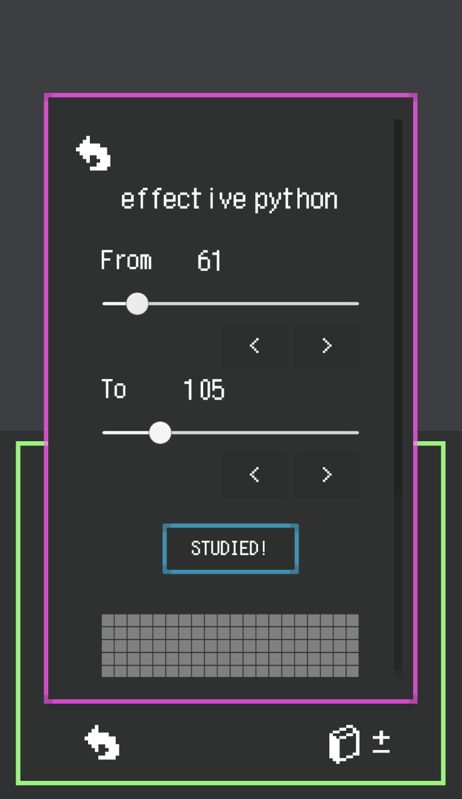

# Wizardry
a unity based reading management tool  

## Basic Concept
This tool will help you to enjoy your study time by providing training game like experience.
You can add your own books and manage your reading progress.

## Assets
### Font
the font used in this project is JF Dot Shinonome 12px, which belongs to public domain.
[you can download JF Dot Shinonome 12px from this page](http://jikasei.me/font/jf-dotfont/)

## Detailed Description
please refer to [wiki](https://github.com/tsunekazuomija/Wizardry/wiki).