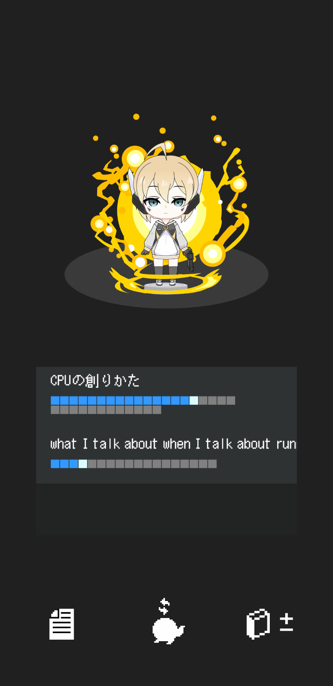
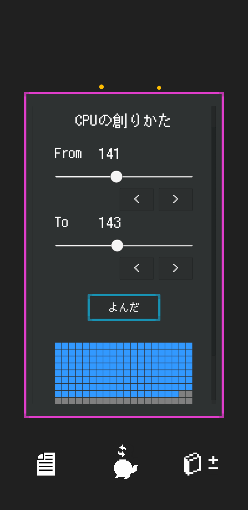

# Wizardry
a unity based reading management tool  

## Basic Idea
This tool will help you to enjoy your study time by providing training game like experience.
You can add your own books and manage your reading progress.

## Assets
### Font
the font used in this project is JF Dot Shinonome 12px, which belongs to public domain.
[you can download JF Dot Shinonome 12px from this page](http://jikasei.me/font/jf-dotfont/)

### Character
@tsunekazuomija drew the standing picture of the character.
However, the mascot itself is not original but based on "Komakkero", 
the official mascot of the Komaba Festival of the University of Tokyo.
Also, this character is being used temporarily to confirm the game's operation, 
and I do not plan to use it in the official release of this game.
